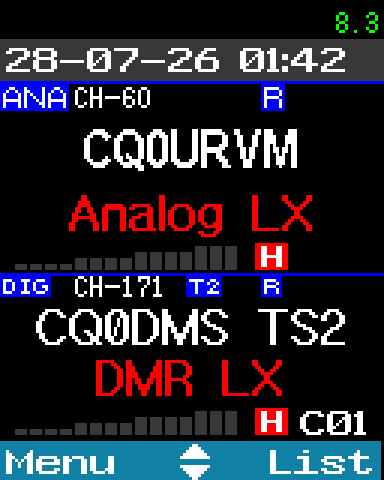

# at168-refw-docs

Community documentation for **reFW**, a custom firmware for the
**AnyTone AT-D168UV** handheld radio.

reFW builds directly on top of AnyTone's factory firmware. These pages
cover everything it changes, grouped by what you're doing with the
radio: most new options live in **Settings → Extras**, and reFW also
adds key functions, stores some settings per channel, renames labels
and fixes bugs across the rest of the radio.

<p align="center">
  
</p>

The same pages are published as a searchable site at
<https://jcalado.github.io/at168-refw-docs/>.

## What's Here

### Using the radio

<!-- pages: Using the radio -->
| Page | Description |
| --- | --- |
| [docs/display.md](docs/display.md) | Idle screen options, backlight and dimming shortcuts, and new icons |
| [docs/keys.md](docs/keys.md) | Assigning functions to keys, number-key and # shortcuts, the knob, and faster menu entry |
| [docs/calls.md](docs/calls.md) | Contact list shortcuts, call hold times, time slot fallback, RX groups and manual dial |
| [docs/channels.md](docs/channels.md) | Per-channel promiscuous mode and squelch, an analog monitor key, and channel toggles |
| [docs/scanning.md](docs/scanning.md) | VFO scan limits and changing the radio's band mode from the menu |
| [docs/power.md](docs/power.md) | Battery voltage display, a dismissable low-battery warning, and USB charging control |
| [docs/fm-radio-and-clock.md](docs/fm-radio-and-clock.md) | RDS on the broadcast FM receiver, and setting the clock from a PC |
<!-- /pages -->

### Watching DMR traffic

<!-- pages: Watching DMR traffic -->
| Page | Description |
| --- | --- |
| [docs/mat3.md](docs/mat3.md) | Streaming live DMR packet data via MAT3 over USB-C |
| [docs/packet-log.md](docs/packet-log.md) | Recording DMR traffic to flash and pulling the log off the radio |
<!-- /pages -->

### Reference

<!-- pages: Reference -->
| Page | Description |
| --- | --- |
| [docs/extras-menu.md](docs/extras-menu.md) | Every item in Settings → Extras, with its options and default, linked to where it is described |
| [docs/shortcuts.md](docs/shortcuts.md) | Every function reFW adds to the assignable key list, linked to where it is described |
| [docs/renamed-menus.md](docs/renamed-menus.md) | Stock menus, functions and labels that reFW renames or rewords |
| [docs/bug-fixes.md](docs/bug-fixes.md) | Stock firmware bugs that reFW fixes |
<!-- /pages -->

### For tool authors

<!-- pages: For tool authors -->
| Page | Description |
| --- | --- |
| [docs/settings-storage.md](docs/settings-storage.md) | Memory and codeplug offsets for developers building custom CPS tools |
| [docs/packet-log-format.md](docs/packet-log-format.md) | Flash layout and record format of the packet log, for tools that read it |
<!-- /pages -->

## What this repo is (and isn't)

These docs focus on the radio from an operator's perspective, paired
with just enough under-the-hood storage details so folks writing
third-party CPS or tools can reliably read and write settings.

This is neither the source code for reFW nor a guide on
compiling it from scratch.

Firmware builds are stamped by release time (`REFW-YYYYMMDD-HHMMSS.CDD`).
The pages describe the latest build; whenever a specific build is cited,
that's the firmware release where the behavior was verified.

## Companion Projects

Related tools:

- `at168-cps` (**work in progress**): Cross-platform CPS tool with a
  dedicated REFW tab to fetch packet logs, manage licenses, and check
  band modes.
- `at168-flasher`: Utility for flashing firmware and backing up
  device info.
- `at168-gps`: Tool for updating GPS satellite almanac data.

## How we document things

Whenever we cover a setting, you'll find the available **options**, the
factory **default**, and where it lands in **storage**.

We value accuracy over guesswork: if something hasn't been verified on
physical hardware or in disassembly, we explicitly label it as
`Unconfirmed` or `Not yet documented`. If you spot something new or can
fill in a gap, see [CONTRIBUTING.md](CONTRIBUTING.md).

## Previewing the site

The site is built with [Starlight](https://starlight.astro.build/)
straight from the `docs/` folder, and deployed to GitHub Pages on every
push to `main`. To preview it locally:

```sh
npm install
npm run dev
```
